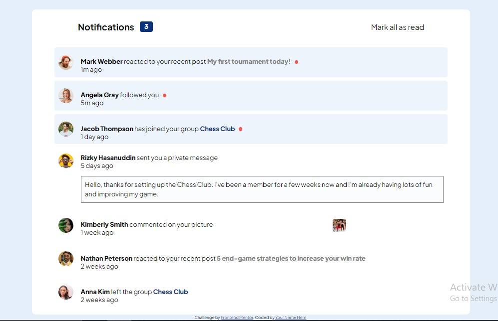

# Frontend Mentor - Notifications page solution

This is a solution to the [Notifications page challenge on Frontend Mentor](https://www.frontendmentor.io/challenges/notifications-page-DqK5QAmKbC). Frontend Mentor challenges help you improve your coding skills by building realistic projects. 

## Table of contents

- [Overview](#overview)
  - [The challenge](#the-challenge)
  - [Screenshot](#screenshot)
  - [Links](#links)
- [My process](#my-process)
  - [Built with](#built-with)
  - [What I learned](#what-i-learned)
  - [Continued development](#continued-development)
  - [Useful resources](#useful-resources)
- [Author](#author)
- [Acknowledgments](#acknowledgments)

## OVERVIEW

### The challenge
Users of this webpage are able to:

- Distinguish between "unread" and "read" notifications
- Select "Mark all as read" to toggle the visual state of the unread notifications and set the number of unread messages to zero
- View the optimal layout for the interface depending on their device's screen size
- See hover and focus states for all interactive elements on the page

### Screenshot

### Links

- Solution URL: https://www.frontendmentor.io/solutions/notification-page-using-html-css-and-javascript-UJ1taP3hSY
- Live Site URL: https://notification-page-frontend-mentor-yange-stephanies-projects.vercel.app/

## MY PROCESS

### Built with
- Semantic HTML5 markup
- CSS custom properties
- CSS Flexbox
- JavaScript

### What I learned
During the course of this project, i learned how to implement the flexbox into my coode and also how to integrate thr forEach loop t loop through elements, targting them with the dom and adding event listener for interactiveness. 

### Continued development
I look forward to futhering my knowdledge on the forEach loop, using it effectively in future projects. 
I also want to refine and perfect my use of the addEventListener in JavaScript. 

## AUTHOR

- Website - [Yange Stephanie Doosuur](https://github.com/Phanhie/)
- Frontend Mentor - [@Phanhie](https://www.frontendmentor.io/profile/phanhie)
- Twitter - [@phanhie_01](https://www.twitter.com/yourusername)

